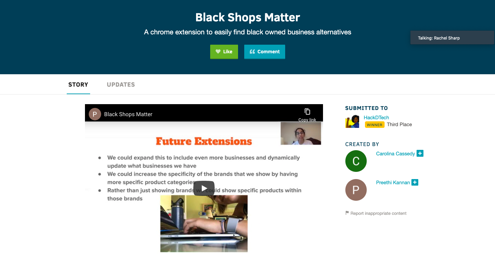
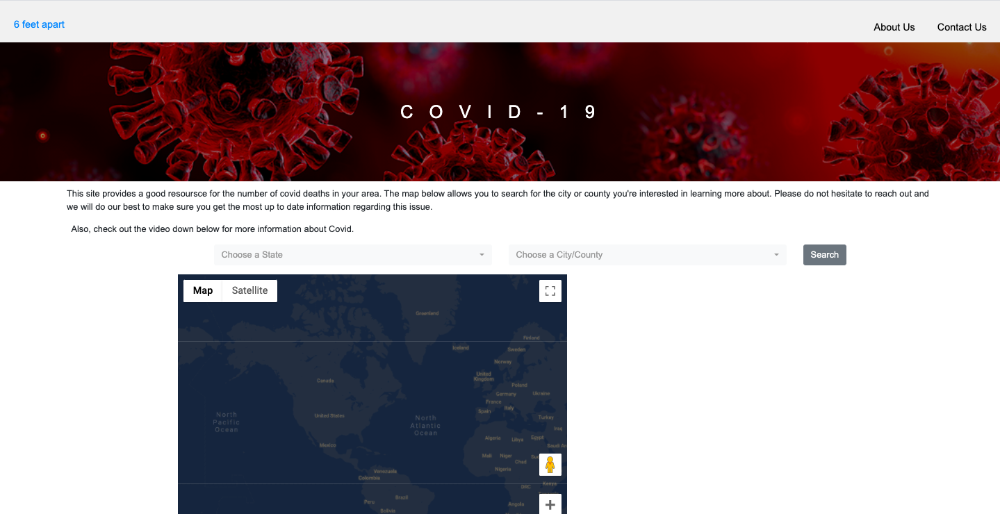

- We built a Chrome extension to help shoppers be conscious of where they are buying from.
- When shopping on Amazon if buyers find a product that has an alternative from a black business a notification will pop up and buyers can check our extension for links to those products.
- Our extension has a list of business alternatives with links to their websites that fall in the same product category as the product the shopper is buying.
- For our project, we used HTML/CSS and Javascript.
- You can read more about the project, challlenges we ran into while building it and future changes [here.](https://docs.google.com/presentation/d/1SsXq68EMiDunt8VGsOBnhI-uVWWspX28yRIxlouO5MI/edit#slide=id.g8dba9aa359_1_393)
- [Here](https://youtu.be/RQSi5_Lzzu8) is a demo.

# 6 Feet Apart

- This website provides a good resoursce for the number of covid confirmed cases/deaths in your area. The map in the site allows you to search for the city or county you're interested in learning more about.
- View the project [here.](https://summer20-sps-16.uc.r.appspot.com/)
- View the teams Github [here.](https://github.com/Team-16-SPS-SM20/sps-group-project-team16)

